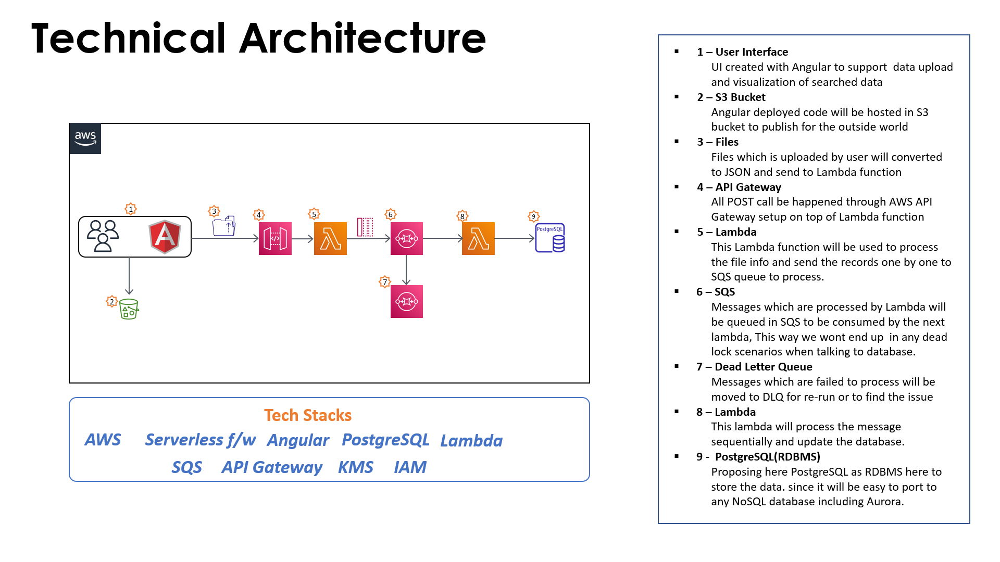

**Asset Manager** 

**Summary**

# Solution

<p align="center">
  
  <br/>
</p>

## Project details

> Source Structure

* book-keeping-ui
* book-keeping-api
* serverless.yml

> CSV File

```cs
time,from_user,to_user,type,amount,stock,price
1572723958024;person-a;person-b;D;200;;
1572807838935;person-a;person-b;W;200;;
1572815038592;person-a;person-b;B;3;APPL;100
1572860758012;person-a;person-b;S;2;APPL;120
```

> Table Structure

#### User Details

| user_id | user_name | active_flag |
|---|---|---|
| john123 | John Miller | Y |

#### Account Details

| account_id | account_type | total_asset | user_id
|---|---|---|---|
| 123456 | Savings | 1687 | john123

#### Booking Details


| from_user | to_user | transaction_time | transaction_date | transaction_flag | transaction_amount | product_type | product_name | product_count
|---|---|---|---|---|---|---|---|---|
| john123 | paul654 | 134567898888 | 10/JAN/2021 | Y | 0 | STOCK | APPL | 5
| john123 | paul654 | 134567898888 | 10/JAN/2021 | Y | 20 |  |  | 
